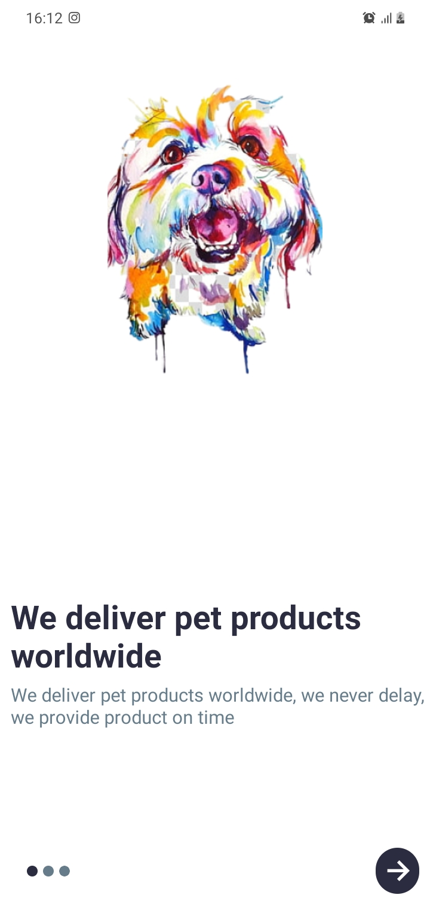
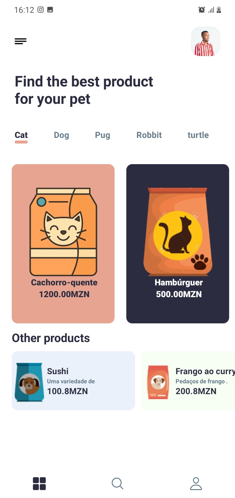
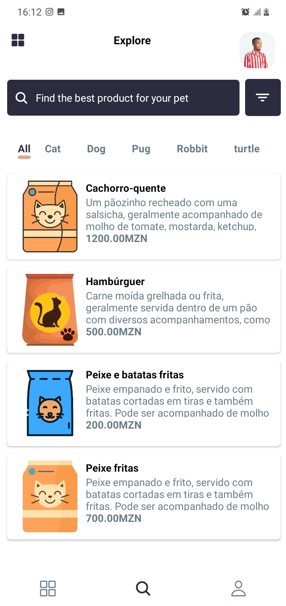
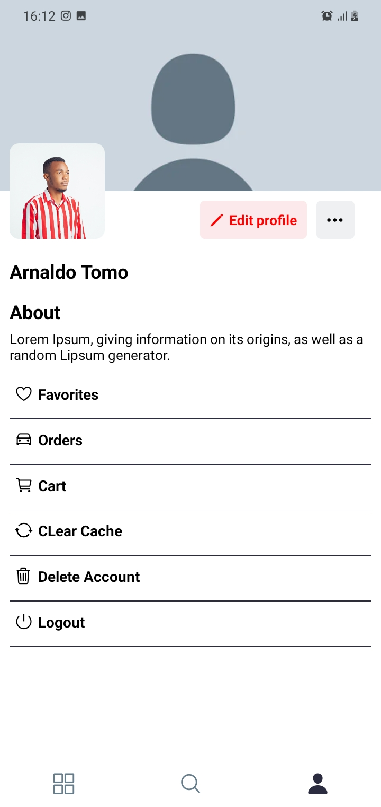
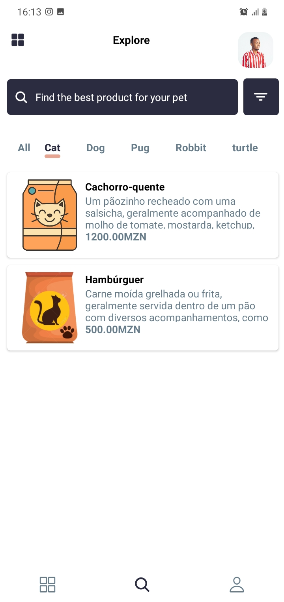
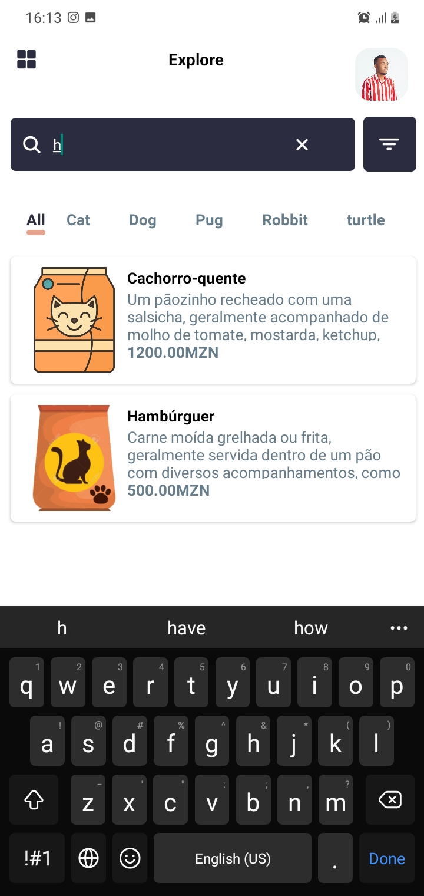
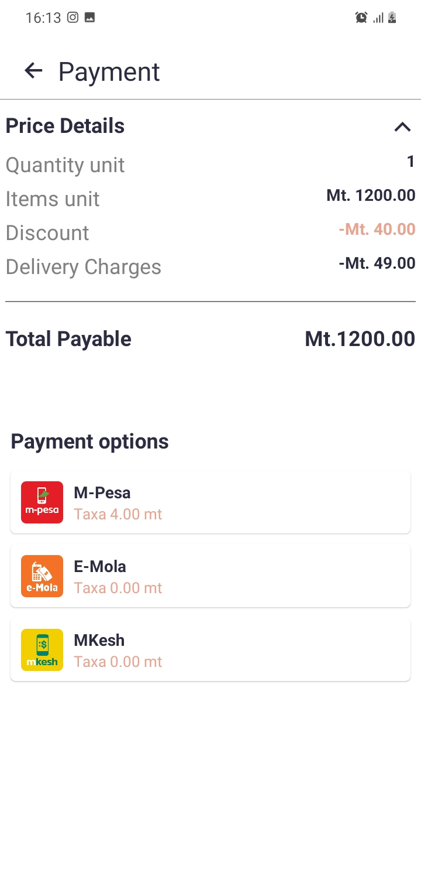
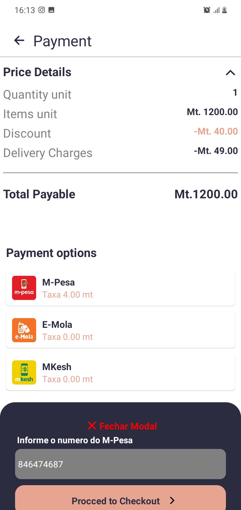

 O AnimalProduts é um aplicativo de compras conveniente e abrangente projetado para atender às necessidades de proprietários de animais de estimação. Este aplicativo oferece uma ampla variedade de alimentos para animais de alta qualidade, acessórios e produtos relacionados para cães, gatos, pássaros, peixes e outros animais de estimação.

clone ou download the project, then run yarn install / npm install
pt: Clone ou baixe o projecto pro seu computador e depois corra o seguinte comando: yarn install ou npm install. Garanta que tenhas Nodejs instaldo no seu pc antes de nada. 

down a link for a server side project <a href="https://github.com/arnaldo-tomo/AnimalProduts">Here</a>

open the URL for download APK. <a href="https://expo.dev/artifacts/eas/DJM4tPEK53U9Lkn9i28Az.apk">Here</a>

open the URL below to install it on a device. <a href="https://expo.dev//accounts/arnaldotomo/projects/AnimalProduts/builds/0544e1b6-6083-4721-b295-edf057df8fc9">Here</a>

    

     

      

 
